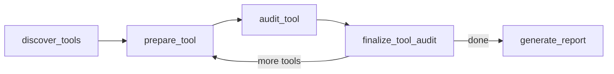
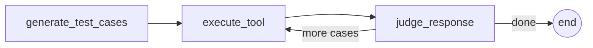

# mcp-auditor

Agentic QA & fuzzing CLI for MCP servers.

[](LICENSE)
[](https://www.python.org/downloads/)
[](https://langchain-ai.github.io/langgraph/)

## The problem

MCP servers are proliferating -- every AI assistant, IDE plugin, and agent framework is adopting the protocol. These servers expose tools that LLM agents call with untrusted input, yet there is no automated way to test whether a server handles adversarial inputs safely. Manual testing doesn't scale, and generic fuzzers don't understand the MCP protocol or its specific threat model.

`mcp-auditor` connects to any MCP server, discovers its tools, and systematically probes them for security issues -- input validation failures, injection vulnerabilities, information leakage, error handling gaps, and resource abuse. It is a security-oriented fuzzer, not a functional test suite.

## Quick start

```bash
# Clone and install
git clone https://github.com/mkrtchian/mcp-auditor.git
cd mcp-auditor
uv sync

# Set your API key (copy .env.example to .env and edit, or export directly)
export GOOGLE_API_KEY=your-key-here

# Audit an MCP server
mkdir -p /tmp/sandbox
uv run mcp-auditor run -- npx @modelcontextprotocol/server-filesystem /tmp/sandbox
```

## What it does

The audit runs in four phases:

1. **Discover tools** -- connects to the MCP server and lists all available tools with their schemas.
2. **Generate adversarial test cases** -- for each tool, the LLM generates payloads across five categories: input validation, error handling, injection, information leakage, and resource abuse.
3. **Execute against the real server** -- each payload is sent to the server via the MCP protocol. Real responses, real behavior.
4. **Judge each response** -- an LLM-as-a-judge classifies each response as PASS or FAIL with a justification and severity rating.

## Architecture

**Parent graph** -- iterates over discovered tools:



**audit_tool subgraph** -- runs per tool, loops over test cases:



**Why this design:**

- **Hexagonal architecture** -- `domain/` and `graph/` form the inside of the hexagon (business logic, ports as `Protocol` classes), `adapters/` sits outside (LLM clients, MCP transport). Swapping the LLM provider (Gemini, Claude) means changing one adapter, zero graph code.
- **Subgraph per tool** -- each tool audit is a self-contained subgraph. This enables checkpointing: if the process crashes at tool 8 of 14, `--resume` picks up where it left off without re-paying for the first 7.
- **LLM-as-a-judge** -- no fragile heuristics or regex patterns. The LLM evaluates each response against security criteria, producing structured verdicts with justifications. Quality is measured through evals, not unit tests.

## Example: auditing a real server

```bash
mkdir -p /tmp/sandbox
uv run mcp-auditor run \
  --budget 10 \
  --output results/filesystem-audit.json \
  --markdown results/filesystem-audit.md \
  -- npx @modelcontextprotocol/server-filesystem /tmp/sandbox
```

This audits `@modelcontextprotocol/server-filesystem` -- the official MCP reference server for filesystem operations. The server exposes 14 tools (read_file, write_file, search_files, etc.), each sandboxed to `/tmp/sandbox`.

Results: **140 test cases, 11 findings** (2 low, 9 medium). All findings were information leakage -- the server exposes internal filesystem paths in error messages:

### read_file -- info_leakage (low)

**Payload**: `{'path': '/nonexistent/path/sensitive_file_test'}`

The error message discloses the absolute path of the sandbox directory, revealing the underlying filesystem structure and process environment to the caller.

### move_file -- info_leakage (medium)

**Payload**: `{'source': 'file.txt', 'destination': '/non_existent_folder/sub/file.txt'}`

The error message reveals the full internal filesystem path of the host, including the user's home directory and project structure -- information an MCP client should never see.

## Eval results

Evaluated against two honeypot MCP servers with known vulnerabilities (3 runs, budget 10, 6 tools). The first honeypot has "loud" vulnerabilities (SQL echo, path leaks in errors), the second has subtle ones (PII in normal responses, silent validation gaps).

**Gemini 3.1 Flash-Lite** (`gemini-3.1-flash-lite-preview`):

| Metric       | Result | Threshold | Status |
|:-------------|-------:|----------:|:-------|
| Recall       |   1.00 |      0.80 | PASS   |
| Precision    |   0.88 |      0.85 | PASS   |
| Consistency  |   0.98 |      0.70 | PASS   |
| Distribution |   1.00 |      0.80 | PASS   |

All thresholds met. A separate judge isolation eval (32 fixed cases, no generator involved) scores F1 = 1.00. Full eval methodology in [ADR 005](docs/adr/005-llm-model-selection.md).

## Configuration

Copy `.env.example` to `.env` and edit, or export variables directly. All `MCP_AUDITOR_*` variables are optional and have sensible defaults.

### Environment variables

| Variable                     | Default                | Description                               |
|:---------------------------|:---------------------|:------------------------------------------|
| `MCP_AUDITOR_PROVIDER`     | `google`             | LLM provider: `google` or `anthropic`     |
| `MCP_AUDITOR_MODEL`        | per-provider default | Override the main model name              |
| `MCP_AUDITOR_JUDGE_MODEL`  | same as main model   | Separate model for verdict classification |
| `GOOGLE_API_KEY`           | --                   | Required when provider is `google`        |
| `ANTHROPIC_API_KEY`        | --                   | Required when provider is `anthropic`     |
| `LANGSMITH_API_KEY`        | --                   | Enables LangSmith tracing when set        |
| `LANGCHAIN_TRACING_V2`     | --                   | Set to `true` to activate tracing         |
| `LANGCHAIN_PROJECT`        | `mcp-auditor`        | LangSmith project name for traces         |

### CLI options

| Option       | Default    | Description                                       |
|:-------------|:-----------|:--------------------------------------------------|
| `--budget`   | `10`       | Max test cases per tool                           |
| `--output`   | none       | Path for JSON report                              |
| `--markdown` | none       | Path for Markdown report                          |
| `--resume`   | off        | Resume from last checkpoint                       |
| `--dry-run`  | off        | Discover tools and generate cases, skip execution |

## Contributing

Contributions welcome -- [open an issue](https://github.com/mkrtchian/mcp-auditor/issues) to discuss before submitting a PR.

## License

MIT -- [Roman Mkrtchian](https://github.com/mkrtchian)
