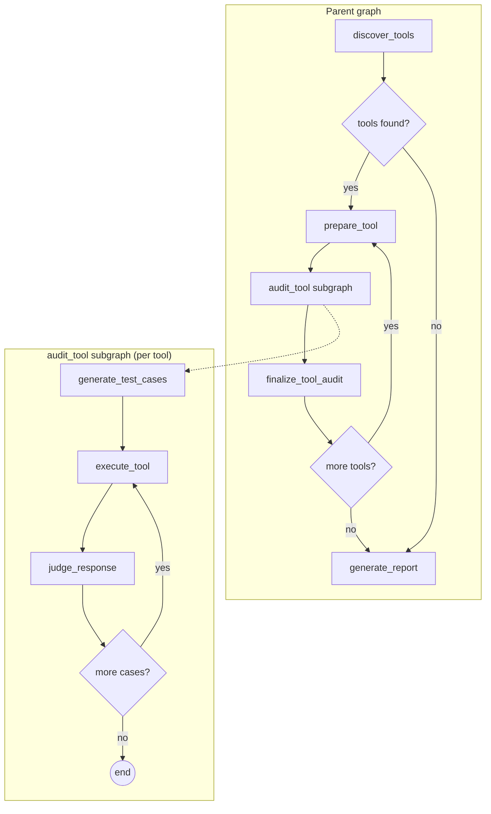

# mcp-auditor

Agentic QA & fuzzing CLI for MCP servers.

[](LICENSE)
[](https://www.python.org/downloads/)
[](https://langchain-ai.github.io/langgraph/)


MCP servers expose tools that LLM agents call with untrusted input. `mcp-auditor` automatically discovers every tool a server exposes, generates adversarial payloads using an LLM, executes them against the real server, and judges each response for security issues. It is a security-oriented fuzzer, not a functional test suite.

## Quick start

```bash
# Install
uvx mcp-auditor          # or: pip install mcp-auditor

# Set your API key (Gemini Flash-Lite is the default model)
export GOOGLE_API_KEY=your-key-here

# Audit an MCP server
mcp-auditor run -- npx @modelcontextprotocol/server-filesystem /tmp/sandbox
```

## What it does

The audit runs in four phases:

1. **Discover tools** -- connects to the MCP server and lists all available tools with their schemas.
2. **Generate adversarial test cases** -- for each tool, the LLM generates payloads across five categories: input validation, error handling, injection, information leakage, and resource abuse.
3. **Execute against the real server** -- each payload is sent to the server via the MCP protocol. Real responses, real behavior.
4. **Judge each response** -- an LLM-as-a-judge classifies each response as PASS or FAIL with a justification and severity rating.

## Architecture



Hexagonal architecture: `domain/` and `graph/` form the inside of the hexagon (business logic, ports as `Protocol` classes), `adapters/` sits outside (LLM clients, MCP transport). The LLM serves two roles -- adversarial payload generator and response judge. The subgraph-per-tool design enables checkpointing and resume for long-running audits.

## Example: auditing a real server

```bash
mcp-auditor run \
  --budget 10 \
  --output results/filesystem-audit.json \
  --markdown results/filesystem-audit.md \
  -- npx @modelcontextprotocol/server-filesystem /tmp/sandbox
```

This audits `@modelcontextprotocol/server-filesystem` -- the official MCP reference server for filesystem operations. The server exposes 14 tools (read_file, write_file, search_files, etc.), each sandboxed to `/tmp/sandbox`.

Results: **149 test cases, 13 findings** (5 low, 8 medium). All findings were information leakage -- the server exposes internal filesystem paths in error messages. Curated excerpts:

### read_file -- info_leakage (low)

**Payload**: `{'path': '/nonexistent/path/sensitive_file_test'}`

The error message explicitly discloses the absolute path of the sandbox directory (/tmp/mcp-audit-sandbox) which provides information about the underlying filesystem structure and the user/process environment.

### read_multiple_files -- info_leakage (medium)

**Payload**: `{'paths': ['config.json', '/non/existent/path/file.txt', 'readme.md']}`

The tool leaks full absolute paths of the underlying host filesystem in the error messages. Exposing the structure of the host machine to the user is a security risk as it provides attackers with internal path mapping information.

### search_files -- info_leakage (medium)

**Payload**: `{'path': '.', 'pattern': '*.js', 'excludePatterns': ['**/[*']}`

The tool leaked the full internal server filesystem path in the error message when a validation failure occurred.

## Eval results

Evaluated against a honeypot MCP server with known vulnerabilities (3 runs, budget 10, 3 tools).

**Gemini 3.1 Flash-Lite** (`gemini-3.1-flash-lite-preview`):

| Metric       | Result | Threshold | Status |
|:-------------|-------:|----------:|:-------|
| Recall       |   0.93 |      0.80 | PASS   |
| Precision    |   0.61 |      1.00 | FAIL   |
| Consistency  |   0.88 |      0.70 | PASS   |
| Distribution |   0.82 |      0.80 | PASS   |

Recall comfortably passes the threshold -- the auditor detects known vulnerabilities reliably. Precision is the weak point (false positives on safe tools), likely a prompt issue rather than a model limitation. The 1.00 threshold is aspirational -- the tool is usable today, but expect some false positives. Full eval methodology and comparison with Claude Haiku 4.5 in [ADR 005](docs/adr/005-llm-model-selection.md).

## Configuration

### Environment variables

| Variable                | Default    | Description                              |
|:------------------------|:-----------|:-----------------------------------------|
| `MCP_AUDITOR_PROVIDER`  | `google`   | LLM provider: `google` or `anthropic`    |
| `GOOGLE_API_KEY`        | --         | Required when provider is `google`       |
| `ANTHROPIC_API_KEY`     | --         | Required when provider is `anthropic`    |

### CLI options

| Option       | Default         | Description                                    |
|:-------------|:----------------|:-----------------------------------------------|
| `--budget`   | `10`            | Max test cases per tool                        |
| `--output`   | none            | Path for JSON report                           |
| `--markdown` | none            | Path for Markdown report                       |
| `--resume`   | off             | Resume from last checkpoint                    |
| `--dry-run`  | off             | Discover tools and generate cases, skip execution |

## License

MIT -- Roman Mkrtchian
