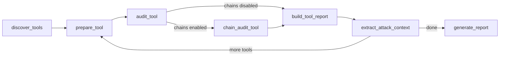
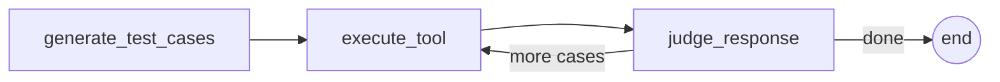
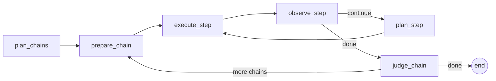

# mcp-auditor

Agentic security testing for MCP servers.

[](https://pypi.org/project/mcp-auditor/)
[](https://github.com/mkrtchian/mcp-auditor/actions/workflows/ci.yml)
[](https://github.com/mkrtchian/mcp-auditor/actions/workflows/evals.yml)
[](https://langchain-ai.github.io/langgraph/)


## The problem

MCP servers expose tools that LLM agents call with untrusted input. There is no automated way to test whether a server handles adversarial inputs safely. Manual testing doesn't scale, and generic fuzzers don't understand the MCP protocol or its threat model.

MCP security tools today focus on **static analysis** of tool descriptions (detecting poisoning before any call is made) and **runtime proxies** that intercept traffic in production. `mcp-auditor` takes a third approach: **dynamic adversarial testing**. It connects to a live server, generates adversarial inputs, executes them, and judges whether the responses reveal vulnerabilities. Think SAST vs. DAST in web security.

`mcp-auditor` probes for input validation failures, injection, information leakage, error handling gaps, and resource abuse. It produces structured verdicts with justifications and severity ratings.

## Quick start

```bash
# Set your API key (Google AI Studio has a free tier: aistudio.google.com/apikey)
export GOOGLE_API_KEY=your-key-here

# Audit an MCP server
mkdir -p /tmp/sandbox
uvx mcp-auditor run -- npx @modelcontextprotocol/server-filesystem /tmp/sandbox
```

Every audit run reports its token usage. Cost and runtime scale with `--budget` (default 10 test cases per tool), so start low to size a run against your own server.

## What it does

The audit runs in four phases, with an optional fifth:

1. **Discover tools**: connect to the MCP server, list available tools with their schemas.
2. **Generate adversarial test cases**: for each tool, the LLM generates payloads across five categories (input validation, error handling, injection, information leakage, resource abuse).
3. **Execute against the real server**: each payload is sent via the MCP protocol. Real responses, real behavior.
4. **Judge each response**: an LLM-as-a-judge classifies each response as PASS or FAIL with a justification and severity rating. Findings are mapped to the [OWASP MCP Top 10](https://owasp.org/www-project-model-context-protocol-top-10/) when applicable.
5. **Multi-step attack chains** *(opt-in via `--chains`)*: after single-step testing, the LLM plans adaptive attack sequences where each step's payload depends on the previous step's response. Probe, observe, escalate. Catches vulnerabilities that require multiple interactions, like symlink traversal or state-dependent injection. [ADR 010](docs/adr/010-multi-step-attack-chains.md)

## Scope and limitations

`mcp-auditor` audits one slice of the MCP attack surface, on purpose. Knowing the edges matters for a security tool.

- **Transport: local stdio only.** It audits servers you launch as a subprocess (`-- npx ...`). Remote Streamable HTTP servers are on the roadmap, not supported yet. Auth, token, and transport-level attacks stay out of scope until then.
- **Primitive: Tools only.** MCP servers expose three primitives (Tools, Resources, Prompts). `mcp-auditor` tests the Tools surface, where the model invokes the server's functions. Resources and Prompts are not audited, and it does not offer client capabilities, so it does not test a server that abuses Sampling.
- **Direction: client to server.** It tests whether a server withstands a manipulated LLM client (adversarial inputs into tools). It does not replay a full server-to-client attack, where a malicious server turns the host's agent against its user. Detecting that end to end needs a real host agent with its own tools and data, which `mcp-auditor` is not.
- **One server, tools in isolation.** It audits a single server and judges each tool on its own. It does not assess session-level risk, how the audited tools combine with the other tools an agent holds at once. The lethal trifecta (private data, untrusted content, exfiltration) assembles from that combination, and a per-server audit does not see it.
- **Observable effects only.** It flags a vulnerability when the effect surfaces in a tool response. A vulnerability whose only effect is a silent write, a spawned process, or out-of-band exfiltration leaves nothing in the response for the black-box auditor to read, so it stays out of reach until a future instrumented mode (see [ADR 011](docs/adr/011-instrumented-observation-deferred.md)).

## Architecture

**Parent graph** (iterates over discovered tools):



**audit_tool subgraph** (runs per tool, loops over test cases):



**chain_audit_tool subgraph** (adaptive multi-step attack chains):



**Why this design:**

- **Hexagonal architecture.** `domain/` and `graph/` form the inside of the hexagon (business logic, ports as `Protocol` classes), `adapters/` sits outside (LLM clients, MCP transport). Swapping the LLM provider means changing one adapter, zero graph code. [ADR 002](docs/adr/002-hexagonal-architecture.md)
- **Subgraph per tool.** Each tool audit is a self-contained subgraph with checkpointing: if the process crashes at tool 8 of 14, `--resume` picks up where it left off. [ADR 001](docs/adr/001-why-langgraph.md)
- **Cross-tool learning.** After each tool audit, the graph extracts intelligence from the results (database engine, framework, exposed internals). Subsequent tools receive this context for targeted payloads, e.g. SQLite-specific injection after seeing `sqlite3.OperationalError` in a read tool. Read-like tools are audited first to maximize reconnaissance value. [ADR 009](docs/adr/009-cross-tool-learning.md)
- **LLM-as-a-judge.** The LLM evaluates each response against security criteria and produces structured verdicts. No heuristics, no regex. Quality is measured through evals. [ADR 003](docs/adr/003-testing-philosophy.md)
- **Adaptive attack chains.** An optional second pass per tool where the LLM plans multi-step attack sequences. Each step observes the server's response and adapts the next payload: a probe-observe-escalate loop that mimics how a pentester works. Separate subgraph, separate budget, zero overhead when disabled. [ADR 010](docs/adr/010-multi-step-attack-chains.md)

## Example: auditing a real server

```bash
mkdir -p /tmp/sandbox
uvx mcp-auditor run \
  --budget 10 \
  --output output/filesystem-audit.json \
  --markdown output/filesystem-audit.md \
  -- npx @modelcontextprotocol/server-filesystem /tmp/sandbox
```

This audits `@modelcontextprotocol/server-filesystem`, the official MCP reference server for filesystem operations. The server exposes 14 tools (read_file, write_file, search_files, etc.), each sandboxed to `/tmp/sandbox`.

Results: **140 test cases, 11 findings** (2 low, 9 medium). All findings were information leakage: the server exposes internal filesystem paths in error messages.

### read_file / info_leakage / MCP-10 (low)

**Payload**: `{'path': '/nonexistent/path/sensitive_file_test'}`

The error message discloses the absolute path of the sandbox directory, revealing the underlying filesystem structure and process environment to the caller.

### move_file / info_leakage / MCP-10 (medium)

**Payload**: `{'source': 'file.txt', 'destination': '/non_existent_folder/sub/file.txt'}`

The error message reveals the full internal filesystem path of the host, including the user's home directory and project structure.

## Eval results

Evaluated against three honeypot MCP servers with known vulnerabilities (3 runs, budget 10, 8 tools). The first honeypot has loud vulnerabilities (SQL echo, path leaks in errors), the second has subtle ones (PII in normal responses, silent validation gaps), and the third tests multi-step attack chains (reconnaissance → escalation across tool actions).

**Gemini 3.1 Flash-Lite** (`gemini-3.1-flash-lite`):

| Metric       | Result | Threshold | Status |
|:-------------|-------:|----------:|:-------|
| Recall       |   0.88 |      0.80 | PASS   |
| Precision    |   0.85 |      0.85 | PASS   |
| Consistency  |   0.97 |      0.70 | PASS   |
| Distribution |   1.00 |      0.80 | PASS   |

All thresholds met. A separate judge isolation eval (32 fixed cases, no generator involved) scores F1 = 1.00. Full eval methodology in [ADR 005](docs/adr/005-llm-model-selection.md).

### CVE validation

A second benchmark runs the auditor against real, pinned-vulnerable MCP reference servers (filesystem, git, kubernetes, fetch) to check that known CVEs are actually detected. It is fully reproducible on any machine with two prerequisites: **Docker** (hosts the throwaway vulnerable targets) and an **LLM API key** (for the auditor itself). No cluster, no per-server CLI, no per-server key.

```bash
# 1. Prerequisites: Docker running, an LLM API key exported (e.g. GOOGLE_API_KEY).
# 2. Build the pinned vulnerable-server images (one-time).
docker compose -f evals/docker/compose.yml build

# 3. Calibrate: no LLM, runs each target's ground-truth exploit and confirms the fixture is live.
uv run python -m evals.run_cve_benchmark --calibrate

# 4. Graded run: the auditor discovers the exploits blind.
uv run python -m evals.run_cve_benchmark --runs 3 --budget 10

# Optional: restrict any mode to specific CVEs with --cve (repeatable).
uv run python -m evals.run_cve_benchmark --cve CVE-2025-53109 --cve CVE-2025-53355 --runs 1 --budget 10
```

Safety: the images are deliberately-vulnerable known-RCE/SSRF servers, run in throwaway `docker run --rm` containers against a synthetic per-run sentinel (never a real secret). Run the benchmark on a non-sensitive host, not on a machine holding production credentials.

The detection results table is published from an actual graded run, out of this documentation.

## Configuration

Copy `.env.example` to `.env` and edit, or export variables directly. All `MCP_AUDITOR_*` variables are optional and have sensible defaults.

### Environment variables

| Variable                     | Default                | Description                               |
|:---------------------------|:---------------------|:------------------------------------------|
| `MCP_AUDITOR_PROVIDER`     | `google`             | LLM provider: `google` or `anthropic`     |
| `MCP_AUDITOR_MODEL`        | per-provider default | Override the main model name              |
| `MCP_AUDITOR_JUDGE_MODEL`  | same as main model   | Separate model for verdict classification |
| `GOOGLE_API_KEY`           | --                   | Required when provider is `google`        |
| `ANTHROPIC_API_KEY`        | --                   | Required when provider is `anthropic`     |
| `LANGSMITH_API_KEY`        | --                   | Enables LangSmith tracing when set        |
| `LANGCHAIN_TRACING_V2`     | --                   | Set to `true` to activate tracing         |
| `LANGCHAIN_PROJECT`        | `mcp-auditor`        | LangSmith project name for traces         |

### CLI options

| Option       | Default    | Description                                       |
|:-------------|:-----------|:--------------------------------------------------|
| `--budget`   | `10`       | Max test cases per tool                           |
| `--tools`    | all        | Comma-separated tool names to audit               |
| `--output`   | none       | Path for JSON report                              |
| `--markdown` | none       | Path for Markdown report                          |
| `--resume`   | off        | Resume from last checkpoint                       |
| `--chains`   | `0` (off)  | Attack chains per tool (adaptive multi-step sequences) |
| `--dry-run`  | off        | Discover tools and generate cases, skip execution |
| `--ci`       | off        | CI mode: no Rich UI, exit 1 on findings           |
| `--severity-threshold` | `medium` | Minimum severity to trigger CI failure    |

### Configuration file

Place a `.mcp-auditor.yml` in your project root to avoid repeating CLI flags:

```yaml
budget: 15
chains: 2
severity_threshold: high
tools:
  - get_user
  - list_items
output: report.json
ci: true
```

CLI flags override config file values.

## Run in CI

`--ci` replaces Rich UI with plain text, keeps all diagnostic output, and exits with code 1 if any finding meets the severity threshold.

```yaml
# .github/workflows/mcp-audit.yml
- name: Audit MCP server
  run: uvx mcp-auditor run --ci -- python my_server.py
```

Use `--severity-threshold` to control which findings trigger a failure:

```bash
# Only fail on high or critical findings
mcp-auditor run --ci --severity-threshold high -- python my_server.py
```

## Contributing

See [CONTRIBUTING.md](CONTRIBUTING.md) for setup, commands, and conventions.

## License

MIT. [Roman Mkrtchian](https://github.com/mkrtchian)

---

Built using [spec-driven-dev](https://github.com/mkrtchian/spec-driven-dev) workflow.
