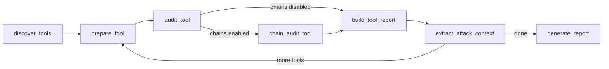
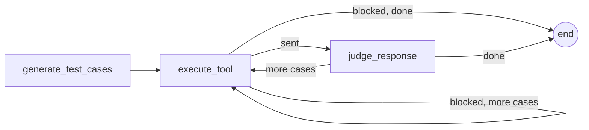
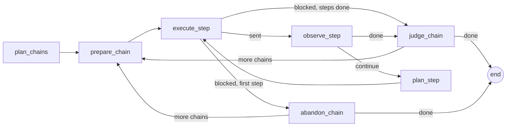

# mcp-auditor

Agentic security testing for MCP servers.

[](https://pypi.org/project/mcp-auditor/)
[](https://github.com/mkrtchian/mcp-auditor/actions/workflows/ci.yml)
[](https://github.com/mkrtchian/mcp-auditor/actions/workflows/evals.yml)
[](https://langchain-ai.github.io/langgraph/)


## The problem

MCP servers expose tools that LLM agents call with untrusted input. Testing that surface by hand does not scale, and generic fuzzers know nothing about the MCP protocol or its threat model.

Most MCP security tooling today works from one of two angles. **Static analysis** reads the declared surface (tool descriptions and JSON schemas) and flags poisoning before any call is made. **Runtime observation** watches a server behave, either as a proxy on live traffic or in a sandbox that builds and runs it, and reports what the process does at the syscall and network level. Both watch a server doing its normal work.

`mcp-auditor` sends the server hostile input instead. It connects to a live server, generates adversarial payloads, executes them, and judges whether the responses reveal vulnerabilities. It probes for input validation failures, injection, information leakage, error handling gaps, and resource abuse, and produces structured verdicts with justifications and severity ratings.

## Quick start

```bash
# Set your API key (Google AI Studio has a free tier: aistudio.google.com/apikey)
export GOOGLE_API_KEY=your-key-here

# Audit an MCP server (the server runs in a Docker container, so Docker must be running)
mkdir -p /tmp/sandbox
uvx mcp-auditor run -- npx @modelcontextprotocol/server-filesystem /tmp/sandbox

# Or launch it on this host instead, with your privileges (no Docker needed)
uvx mcp-auditor run --unconfined -- python my_server.py
```

By default the audited server runs in a container: Docker has to be installed and its daemon running, or the audit stops before anything is launched. `--unconfined` runs the server directly on this host, which is the form to use for a server whose code you wrote and trust, or on a machine without Docker.

Every audit run reports its token usage. Cost and runtime scale with `--budget`, the number of test cases asked of the generator for each tool (10 by default), so start low to size a run against your own server.

## What it does

The audit runs in four phases, with an optional fifth:

1. **Discover tools**: connect to the MCP server, list available tools with their schemas.
2. **Generate adversarial test cases**: for each tool, the LLM generates payloads across five categories (input validation, error handling, injection, information leakage, resource abuse). A batch that comes back short of the budget or of the categories is asked for once more, a batch still missing categories after the retry is asked for those categories alone, and a tool whose batch is still incomplete after that is flagged, with the cases received and the categories missing, in every output format.
3. **Execute against the real server**: each payload is sent via the MCP protocol. Real responses, real behavior.
4. **Judge each response**: an LLM-as-a-judge classifies each response as PASS or FAIL with a justification and severity rating. Findings are mapped to the [OWASP MCP Top 10](https://owasp.org/www-project-mcp-top-10/) when applicable.
5. **Multi-step attack chains** *(opt-in via `--chains`)*: after single-step testing, the LLM plans adaptive attack sequences where each step's payload depends on the previous step's response. Probe, observe, escalate. Chains call one tool repeatedly, so they catch vulnerabilities that need an earlier probe to surface internal state before a later payload uses it. Sequencing a discovery on one tool into an exploit on another is not built yet. [ADR 010](docs/adr/010-multi-step-attack-chains.md)

## Scope and limitations

`mcp-auditor` audits one slice of the MCP attack surface, on purpose.

- **Transport: local stdio only.** It audits servers you launch yourself, as a container or as a subprocess (`-- npx ...`). Remote Streamable HTTP servers are on the roadmap, not supported yet. Auth, token, and transport-level attacks stay out of scope until then.
- **Primitive: Tools only.** MCP servers expose three primitives (Tools, Resources, Prompts). `mcp-auditor` tests the Tools surface, where the model invokes the server's functions. Resources and Prompts are not audited, and it does not offer client capabilities, so it does not test a server that abuses Sampling.
- **Direction: client to server.** It tests whether a server withstands a manipulated LLM client (adversarial inputs into tools). It does not replay a full server-to-client attack, where a malicious server turns the host's agent against its user. Detecting that end to end needs a real host agent with its own tools and data, which `mcp-auditor` is not.
- **One server, tools in isolation.** It audits a single server and judges each tool on its own. It does not assess session-level risk, how the audited tools combine with the other tools an agent holds at once. The lethal trifecta (private data, untrusted content, exfiltration) assembles from that combination, and a per-server audit does not see it.
- **Payloads that do not aim to destroy, on a server that still gets written to.** A deterministic guard refuses a payload before it is sent when its arguments contain one of a short enumerated list of destructive constructs (`rm -rf`, `DROP TABLE`, a fork bomb, and a handful more). Refused payloads appear in the report as blocked, never sent, never judged. The list is short and literal, so some destructive calls pass it. And the auditor calls the server's own tools with adversarial arguments, so **if a tool writes, auditing it writes**, and it cannot observe a call's side effects ([ADR 011](docs/adr/011-instrumented-observation-deferred.md)) so it cannot promise their absence. [ADR 013](docs/adr/013-non-destructive-payloads.md)
- **Observable effects only.** It flags a vulnerability when the effect surfaces in a tool response. A vulnerability whose only effect is a silent write, a spawned process, or out-of-band exfiltration leaves nothing in the response for the black-box auditor to read, so it stays out of reach until a future instrumented mode (see [ADR 011](docs/adr/011-instrumented-observation-deferred.md)).
- **Confined by default.** The audited server runs in a Docker container: it does not see the rest of your filesystem, the services bound to your host's loopback interface, your privileges (all capabilities dropped, no privilege escalation, your own uid), or the auditor's environment and API key. What it does see: the paths your command names, mounted writable at the same absolute path, and the Internet, since egress stays open. An argument counts as a path only when the whole argument is spelled like one (absolute, `.`, `..`, `./…`, `../…`), so `--root=./data` is not mounted and a bare word like `build` never is. The report records the regime, the image and its digest, and the mounted paths. A command that is already a `docker run` is audited as you wrote it, flags included, and `--unconfined` launches the server on this host with your privileges. Starting containers requires membership in the `docker` group, which is equivalent to root on the host. [ADR 017](docs/adr/017-confined-target-execution.md), [ADR 018](docs/adr/018-container-confinement.md)

**Safety:** run the auditor only against a server whose state you can restore, never against production. A secret the audited server reads under a mounted path is a live secret of your host, not of a copy. And treat the audit report as sensitive. To prove impact, the auditor reads real data, environment variables included, so a finding can quote a live secret, and nothing redacts it ([ADR 014](docs/adr/014-proving-impact.md)). The same secret reaches the judge model, and your LangSmith traces if tracing is enabled.

The auditor removes its container when a run ends, however it ends. If one is ever left behind, they all carry the same label:

```bash
docker rm -f $(docker ps -aq --filter label=mcp-auditor)
```

## Architecture

**Parent graph** (iterates over discovered tools):


```mermaid
graph LR
    A[discover_tools] --> B[prepare_tool]
    B --> C[audit_tool]
    C -->|chains enabled| D[chain_audit_tool]
    C -->|chains disabled| E[build_tool_report]
    D --> E
    E --> F[extract_attack_context]
    F -->|more tools| B
    F -->|done| G[generate_report]
```

**audit_tool subgraph** (runs per tool, loops over test cases):


```mermaid
graph LR
    S1[generate_test_cases] --> S2[execute_tool]
    S2 -->|sent| S3[judge_response]
    S2 -->|blocked, more cases| S2
    S2 -->|blocked, done| S4((end))
    S3 -->|more cases| S2
    S3 -->|done| S4
```

**chain_audit_tool subgraph** (adaptive multi-step attack chains):


```mermaid
graph LR
    P[plan_chains] --> C[prepare_chain]
    C --> E[execute_step]
    E -->|sent| O[observe_step]
    E -->|blocked, steps done| J[judge_chain]
    E -->|blocked, first step| A[abandon_chain]
    O -->|continue| S[plan_step]
    S --> E
    O -->|done| J
    J -->|more chains| C
    J -->|done| X((end))
    A -->|more chains| C
    A -->|done| X
```

**Why this design:**

- **Hexagonal architecture.** `domain/` and `graph/` form the inside of the hexagon (business logic, ports as `Protocol` classes), `adapters/` sits outside (LLM clients, MCP transport). Swapping the LLM provider means changing one adapter, zero graph code. [ADR 002](docs/adr/002-hexagonal-architecture.md)
- **Subgraph per tool.** Each tool audit is a self-contained subgraph with checkpointing: if the process crashes at tool 8 of 14, `--resume` picks up where it left off. [ADR 001](docs/adr/001-why-langgraph.md)
- **Cross-tool learning.** After each tool audit, the graph extracts intelligence from the results (database engine, framework, exposed internals). Subsequent tools receive this context for targeted payloads, e.g. SQLite-specific injection after seeing `sqlite3.OperationalError` in a read tool. Read-like tools are audited first to front-load reconnaissance. [ADR 009](docs/adr/009-cross-tool-learning.md)
- **LLM-as-a-judge.** The judge classifies each response against per-category criteria and returns a structured verdict with a severity. The criteria are written rules in `domain/category_guidance.py`, versioned and reviewable, not pattern matches over the response, and the judge is scoped to the single category under test so it cannot report a leak while grading an injection. What the evals measure, and what each one licenses, is set out under [Measurement](#measurement). [ADR 003](docs/adr/003-testing-philosophy.md), [ADR 015](docs/adr/015-eval-instruments-and-claims.md)
- **Adaptive attack chains.** The optional multi-step pass of phase 5 runs in its own subgraph, with its own budget and zero overhead when disabled. [ADR 010](docs/adr/010-multi-step-attack-chains.md)

## Example: auditing a real server

```bash
mkdir -p /tmp/sandbox
uvx mcp-auditor run \
  --budget 10 \
  --output output/filesystem-audit.json \
  --markdown output/filesystem-audit.md \
  -- npx @modelcontextprotocol/server-filesystem@2026.1.14 /tmp/sandbox
```

This audits `@modelcontextprotocol/server-filesystem`, the official MCP reference server for filesystem operations. At the audited version it exposed 14 tools (read_file, write_file, search_files, etc.), each sandboxed to `/tmp/sandbox`.

Results, measured on 2026-03-20 against release `2026.1.14`: **140 test cases, 11 findings** (2 low, 9 medium). The auditor reported all 11 as information leakage: internal filesystem paths appearing in error messages.

### read_file / info_leakage / MCP-10 (low)

**Payload**: `{'path': '/nonexistent/path/sensitive_file_test'}`

The error message discloses the absolute path of the sandbox directory, revealing the underlying filesystem structure and process environment to the caller.

### move_file / info_leakage / MCP-10 (medium)

**Payload**: `{'source': 'file.txt', 'destination': '/non_existent_folder/sub/file.txt'}`

The error message reveals the full internal filesystem path of the host, including the user's home directory and project structure.

## Measurement

Three instruments run here, each answering a different question, and one question has no instrument yet.

**The honeypot suite is a regression guard.** It runs three servers with planted flaws against a ground truth written by hand (`evals/ground_truth.py`), and it gates the build on main. Its job is catching regressions on servers this project wrote, and it says nothing about a server it did not write. Of the five categories the generator works from, resource abuse has no positive case anywhere here, neither in the honeypots nor among the CVE targets, so a regression that removed its detection entirely would move no number. The suite is currently under its precision threshold, which is what the Evals badge at the top of this README reports. A red build on main blocks the trunk until it is fixed forward. Its metrics are not published here as a measure of quality: a regression guard licenses no quality claim, and the set could not carry one anyway. With 8 expected positives, one false positive moves a run's precision by about 0.11, and the metric has three or four reachable values near its threshold. [ADR 016](docs/adr/016-eval-gate-governance.md) replaces the suite's absolute thresholds with a paired, cell-by-cell comparison against a recorded baseline, backed by an absolute floor per metric. [ADR 020](docs/adr/020-honeypot-baseline-changes.md) governs how that baseline changes. The paired gate is built, and no baseline is recorded yet: the absolute thresholds stand until the first recording.

**The judge is calibrated on 32 fixed cases.** No generator sits in the loop, and it gates the build below its F1 threshold. Eight of the 32 are positive, so any recall figure would rest on eight cases. The set was built to cover the judge's own observed failure modes, which makes it a development set: a figure measured on it reports fit rather than generalization, so no figure is published here. [ADR 006](docs/adr/006-judge-evaluation-strategy.md)

**The CVE benchmark runs real MCP servers.** They are pinned at vulnerable versions and run in throwaway Docker containers. A CI gate replays the fixtures' hand-written exploits with no LLM and fails when a planted sentinel stops surfacing, minus one CI-unstable target that local calibration covers instead. That gate proves the fixtures are still exploitable, and it observes nothing about the auditor. No detection rate is published. Six CVE targets across four servers resolve whether the auditor reaches a class of flaw at all, and they do not measure a rate. Three of the six have had their traces read, and later changes were tuned on what those traces showed, so they cannot support a capability claim anymore. What each target resolved is in the per-target report of a graded run, which anyone can reproduce below. [ADR 015](docs/adr/015-eval-instruments-and-claims.md) confines capability claims to a held-out layer of fresh targets chosen under a rule written in advance. That layer does not exist yet, and the unread targets do not form it.

**What is not measured.** The false-positive rate on a healthy server. You want that number before wiring an auditor into CI, and nothing here produces it. An auditor that raises false alarms is unusable whatever its recall. The instrument for it is a suite over patched reference servers, and it does not exist yet. The audit shown above does not answer it either. It is one dated run against a server this project did not write, its findings are the judge's verdicts, and nobody has sorted them into real leaks and false alarms.

### Reproducing the CVE benchmark

The CVE benchmark runs against real, pinned-vulnerable MCP servers (filesystem, git, kubernetes, fetch). It is reproducible on any machine with two prerequisites: **Docker** (hosts the throwaway vulnerable targets) and an **LLM API key** (for the auditor itself). No cluster, no per-server CLI, no per-server key.

```bash
# 1. Prerequisites: Docker running, an LLM API key exported (e.g. GOOGLE_API_KEY).
# 2. Build the pinned vulnerable-server images (one-time).
docker compose -f evals/docker/compose.yml build

# 3. Calibrate: no LLM, runs each target's ground-truth exploit and confirms the fixture is live.
uv run python -m evals.run_cve_benchmark --calibrate

# 4. Graded run: the auditor discovers the exploits blind.
uv run python -m evals.run_cve_benchmark --runs 3 --budget 10

# Optional: restrict any mode to specific CVEs with --cve (repeatable).
uv run python -m evals.run_cve_benchmark --cve CVE-2025-53109 --cve CVE-2025-53355 --runs 1 --budget 10
```

**Safety:** the images are deliberately vulnerable known-RCE/SSRF servers, run in throwaway `docker run --rm` containers with all capabilities dropped, no privilege escalation, a process bound, and the vulnerable servers running as an unprivileged user, against a synthetic per-run sentinel (never a real secret). The filesystem, git and kubernetes fixtures run with no network. The SSRF fixture keeps a dedicated network to reach its sentinel, and that network is a plain bridge with the host gateway and Internet egress. Starting the containers requires membership in the `docker` group, which is equivalent to root on the host. Run the benchmark on a non-sensitive host, not on a machine holding production credentials.

No detection rate is published (see [Measurement](#measurement)). The graded run reports its results per target, on your machine.

## Configuration

Copy `.env.example` to `.env` and edit, or export variables directly. All `MCP_AUDITOR_*` variables are optional and have sensible defaults.

### Environment variables

| Variable                     | Default                | Description                               |
|:---------------------------|:---------------------|:------------------------------------------|
| `MCP_AUDITOR_PROVIDER`     | `google`             | LLM provider: `google`, `anthropic`, `openai`, `fireworks` or `alibaba` |
| `MCP_AUDITOR_MODEL`        | per-provider default | Override the main model name              |
| `MCP_AUDITOR_JUDGE_MODEL`  | same as main model   | Separate model for verdict classification |
| `MCP_AUDITOR_REASONING`    | per-provider default | Reasoning setting sent to the main and judge models: `minimal`, `low`, `medium` or `high` for `google`, `none`, `low`, `medium`, `high`, `xhigh` or `max` for `openai`, `low`, `medium` or `high` for `fireworks`, not accepted for `anthropic` or `alibaba` |
| `GOOGLE_API_KEY`           | --                   | Required when provider is `google`        |
| `ANTHROPIC_API_KEY`        | --                   | Required when provider is `anthropic`     |
| `OPENAI_API_KEY`           | --                   | Required when provider is `openai`        |
| `FIREWORKS_API_KEY`        | --                   | Required when provider is `fireworks`     |
| `DASHSCOPE_API_KEY`        | --                   | Required when provider is `alibaba` (Alibaba Cloud Model Studio, international) |
| `LANGSMITH_TRACING`        | --                   | Set to `true` to activate tracing         |
| `LANGSMITH_API_KEY`        | --                   | LangSmith API key (required for tracing)  |
| `LANGSMITH_PROJECT`        | --                   | LangSmith project name for traces (unset, LangSmith uses its own default) |
| `LANGSMITH_ENDPOINT`       | US region            | Set to the EU URL if your workspace is EU |
| `MCP_AUDITOR_TOOL_CALL_TIMEOUT` | `30`           | Seconds before a tool call is abandoned and judged as a timeout error |

With the default `google` provider, the main model and the judge both run `gemini-3.5-flash-lite` at thinking level `minimal`. With `anthropic` they run `claude-haiku-4-5-20251001` with no reasoning setting. With `openai` they run `gpt-6-luna` at reasoning effort `medium`. With `fireworks` they run GLM-5.3-Flash (`accounts/fireworks/models/glm-5p3-flash`) at reasoning effort `medium`: it is a thinking-only model, and the schema Fireworks enforces does not stop its reasoning. With `alibaba` they run `qwen3.8-flash` on Alibaba Cloud Model Studio's international endpoint, with thinking always off. The default reasoning applies to the provider's default model only: a model named by `MCP_AUDITOR_MODEL` or `MCP_AUDITOR_JUDGE_MODEL` is sent no reasoning setting, so its API default applies, unless `MCP_AUDITOR_REASONING` is set.

### CLI options

| Option       | Default    | Description                                       |
|:-------------|:-----------|:--------------------------------------------------|
| `--budget`   | `10`       | Test cases requested per tool (a target for the generator, not an enforced cap) |
| `--tools`    | all        | Comma-separated tool names to audit               |
| `--output`, `-o`   | none | Path for JSON report                              |
| `--markdown`, `-m` | none | Path for Markdown report                          |
| `--resume`   | off        | Resume from last checkpoint                       |
| `--chains`   | `0` (off)  | Attack chains per tool (adaptive multi-step sequences) |
| `--dry-run`  | off        | Discover tools and generate cases, skip execution |
| `--ci`       | off        | CI mode: no Rich UI, exit 1 on findings           |
| `--severity-threshold` | `medium` | Minimum severity to trigger CI failure    |
| `--unconfined` | off | Launch the server on this host with your privileges, outside any container |
| `--image`    | per launcher | Image to run the server in, for a launcher the default table does not cover |
| `--mount`    | none       | Host path to mount into the container, `PATH` or `PATH:rw`, read-only by default (repeatable, the path must already exist) |

The confinement options, like every other option, go before the `--` that starts the server's own command:

```bash
mcp-auditor run --mount /etc/ssl/certs -- npx some-mcp-server ./workdir
```

With `--image`, the image has to carry the server's dependencies: `--image my-image -- python ./server.py` mounts `server.py`, not the virtual environment it runs in.

### Configuration file

Place a `.mcp-auditor.yml` in your project root to avoid repeating CLI flags:

```yaml
budget: 15
chains: 2
severity_threshold: high
tools:
  - get_user
  - list_items
output: report.json
ci: true
```

CLI flags override config file values. `unconfined`, `image` and `mount` are deliberately not file keys: the file is read from the audited project's own directory, so a file could otherwise turn off the confinement of the server it ships.

## Run in CI

The false-positive rate on a healthy server is not measured yet (see [Measurement](#measurement)). Until you have triaged a few runs against your own server, read a failing audit job as a signal to open the report before letting it block a merge.

`--ci` replaces Rich UI with plain text, keeps all diagnostic output, and exits with code 1 if any finding meets the severity threshold.

```yaml
# .github/workflows/mcp-audit.yml
- name: Audit MCP server
  run: uvx mcp-auditor run --ci --unconfined -- python my_server.py
```

`--unconfined` is the right form here: the server under audit is your own code, in your own repository, and the runner is throwaway. Drop it to run the server in a container instead, on a runner that has Docker.

Use `--severity-threshold` to control which findings trigger a failure:

```bash
# Only fail on high or critical findings
mcp-auditor run --ci --unconfined --severity-threshold high -- python my_server.py
```

## Contributing

See [CONTRIBUTING.md](CONTRIBUTING.md) for setup, commands, and conventions.

## License

MIT. [Roman Mkrtchian](https://github.com/mkrtchian)

---

Built using [spec-driven-dev](https://github.com/mkrtchian/spec-driven-dev) workflow.
